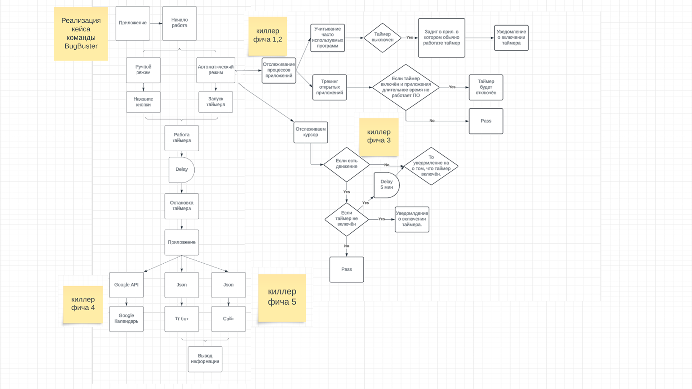

# Проект Time Tracker 😃

## Реализованная функциональность:
1. Приложение Time Tracker
2. Телеграм бот для обработки  информации из приложения
3. Сайт админ-панель

## Особенности проекта:
1. Интеграция с Google таблицами для аналитики и записи данных
2. Анализ времени, проведенного в различных приложениях
3. Уведомления
4. Система трекинга активности пользователь
5. Админ панель
6. Аналитика в телеграм боте
7. Трекер активности приложений

## Основной стек технологий:
1. Python 3.12
   - Библиотеки: time, plyer, datetime, paramiko, pyautogui, textual, google, google_auth_oauthlib, googleapiclient, telebot, json, matholib
2. PHP
3. JSON
4. HTML, CSS
5. ...

## Зависимости

pip install time  
pip install plyer 
pip install datetime 
pip install json 
pip install paramiko 
pip install pyautogui 
pip install textual 
pip install google 
pip install google_auth_oauthlib 
pip install googleapiclient 
pip install telebot 
pip install matplotlib 

## Разработали
1. Бабков Мирослав Витальевич
2. Пугаченко Максим Романович
3. Золотарев Даниил Романович
4. Лушников Дмитрий Анатольевич
5. Супонев Никита Сергеевич